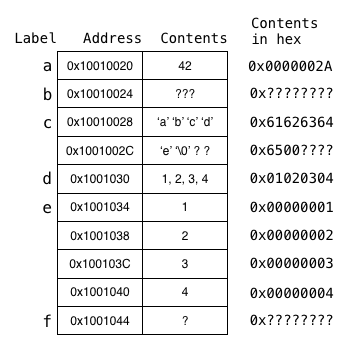

## Registers vs Memory

C doesn't touch registers.

Last week, you didn't touch memory.

What's the difference?

## Words

A word is a fixed-sized piece of data handled by the instruction set.

MIPS is a 32-bit architecture, meaning instructions and 
registers are all 32 bits long.

In MIPS, a word is 32 bits or 4 bytes long.

## Load / Store Architecture

MIPS is a load / store architecture.

Instructions can only do:
- memory access (load or store)
- logic and arithmetic operations

To get something from memory, use:
- lw == load word

To put something into memory, use:
- sw == store word

## Question 1

If the data segment of a particular MIPS program starts at the address 0x10000020, then what addresses are the following labels associated with, and what value is stored in each 4-byte memory cell? 

    .data

0x10000020

    a:  .word   42 - stored in 0x10000020

 sizeof word == 4

 address % 4 == 0
 0x10000025

    b:  .space  4

    c:  .asciiz "abcde"
        .align  2       # What is align?
                        # align memory to address mutliple of 2^n

    e:  .word   1, 2, 3, 4

    d:  .byte   1, 2, 3, 4

    f:  .space  1

## Answer

