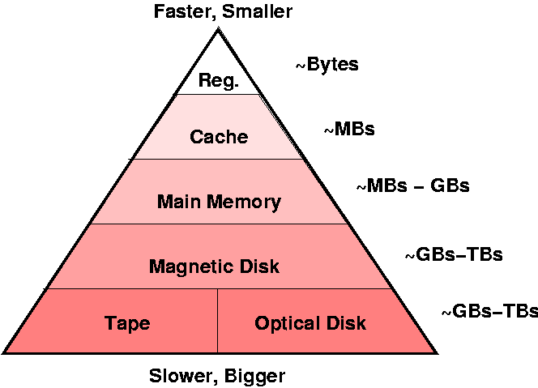

# Week 8 Tutorial

## What does an operating system do?

- Manages resources (CPU time, RAM, power).

- Provides useful services called system calls (files!).

- Bytes are stored in a SSD/USB/Hard drive... but every device is different.

- The OS abstracts all the physical devices used to store bytes into files.

- A lot easier...

## What is a file?

A file is an array of bytes.

## Memory Hierarchy

## Man pages

man lets you browse the Unix Programmer's Manual via the terminal.

write(2) means write is in the 2nd section of the manual.

fopen(3) means fopen is in the 3rd section of the manual.

printf(1) and printf(3) are both in the manual!

Use `man 1 printf` or `man 3 printf` to access the write man page.

If in doubt, use `man man`.

- 1 are General commands
- 2 are System calls
- 3 are C library functions
- 7 are Miscellanea

## Question 1

What does fopen(3) do? What are its parameters?

fopen("example.txt", "r")

What happens if you use writing mode?

## Question 2

What are some circumstances when fopen(3) returns NULL?

FILE *stream = fopen();

fprintf(stream, "...");

NULL = error
file doesn't exist
no permissions
No more RAM left.
No more hard drive space

## Question 3

How do you print the specific reason that caused fopen(3) to return NULL?

What is errno and errno.h?

Last error that occurred

strerror(errno) returns "No enough memory" or "permission error"
perror("") // print error

## Question 7

Why should you not use fgets(3) or fputs(3) with binary data?

C stops 0b00000000

## Question 8

What does the following printf(3) statement display?

printf ("%c%c%c%c%c%c", 72, 101, 0x6c, 108, 111, 0x0a);

Try to work it out without simply compiling and running the code. The ascii(7) manual page will help with this; read it by running man 7 ascii. Then, check your answer by compiling and running.

## Question 9

How many different values can fgetc(3) return?

// byte -> 0-255, 2^8 = 256
// 0 to 127
// -1
// -1 to 255

## Question 10

Why are the names of fgetc(3), fputc(3), getc(3), putc(3), putchar(3), and getchar(3) misleading?

// ascii -> 0 to 127
// work for any byte

// Ken Thompson
// unicode / utf-8 - emojis, japanese, russian
// superset of ascii

// 

## Question 11

For each of the following calls to the fopen() library function, give an open() system call that has equivalent semantics relative to the state of the file.

Obviously, fopen() returns a FILE*, and open() returns an integer file descriptor. Ignore this for the purposes of the question; focus on the state of the open file.

// C library functions vs system calls

Operating systems provides system calls

fprintf - format string "%d %s %c"
|
v
write

fopen - FILE*
|
v
open -> file descripters ~ int

int fd = open("blah")
write(fd, "string")

// fprintf
// write
// read
// fputs

open(O_CREAT|O_WRONLY|O_TRUNC)

### a
fopen(FilePath, "r")

open(O_RDONLY)

### b
fopen(FilePath, "a")
open(O_CREAT|O_WRONLY)

### c
fopen(FilePath, "w")
open(O_CREAT|O_WRONLY|O_TRUNC)

### d
fopen(FilePath, "r+")
open(O_RDWR)

### e
fopen(FilePath, "w+")
open(O_CREAT|O_RDWR|O_TRUNC)

## Question 12

Consider the lseek(fd, offset, whence) function.

### a
What is its purpose?

### b
When would it be useful?

### c
What does its return value represent?

## Question 13

Consider a file of size 10000 bytes, open for reading on file descriptor fd, initially positioned at the start of the file (offset 0). What will be the file position after each of these calls to lseek()? Assume that they are executed in sequence, and one will change the file state that the next one deals with.

// SEEK_END - end of file
// SEEK_SET - start of file
// SEEK_CUR - current position

### a
lseek(fd, 0, SEEK_END);

file_pointer = 10000

### b
lseek(fd, -1000, SEEK_CUR);

file_pointer = 9000

### c
lseek(fd, 0, SEEK_SET);

file_pointer = 0

### d
lseek(fd, -100, SEEK_SET);

lseek(fd, 100, SEEK_END);

10000 bytes

lseek(fd, 100000000000, SEEK_END);

10000 bytes
100 GB hole
10 bytes

file_pointer - is an error

### e
lseek(fd, 1000, SEEK_SET);

### f
lseek(fd, 1000, SEEK_CUR);

## Question 14

If a file xyz contains 2500 bytes, and it is scanned using the following code.

Assume that all of the relevant #include's are done.

How many calls with be made to the read() function, and what is the value of nb after each call?

int fd;         // open file descriptor
int nb;         // # bytes read
int ns = 0;     // # spaces
char buf[BUFSIZ]; // input buffer

fd = open ("xyz", O_RDONLY);
assert (fd >= 0);
while ((nb = read (fd, buf, 1000)) > 0) {
	for (int i = 0; i < nb; i++)
		if (isspace (buf[i]))
			ns++;
}
close (fd);
